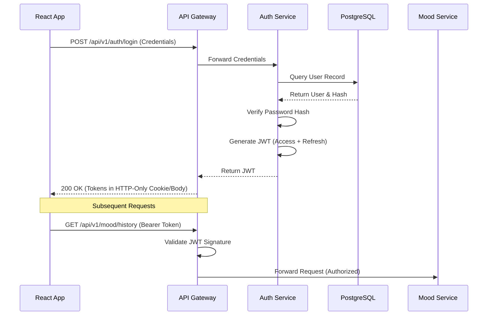
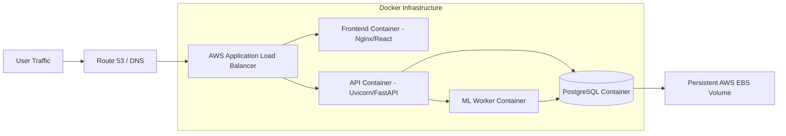

# ARCHITECTURE.md

## 1. High-Level Architecture

MindGuard follows a modular, micro-monolith architectural pattern. The system relies on an API Gateway pattern to manage routing between the client interfaces (Web App / Mobile App)  and backend micro-services. This design ensures that the Processing Layer (AI/ML)  operates asynchronously without blocking standard CRUD operations, optimizing for both high-throughput student check-ins and computationally heavy NLP tasks.

---

## 2. Low-Level Architecture & Component Diagram

The system is divided into three primary layers: the Client Layer, the API Gateway & Backend Services, and the Database/Processing Layer.

```mermaid
graph TD
    %% Client Layer
    subgraph Client Layer
        Web[Web App - React/Tailwind]
        Mobile[Mobile App - PWA/Flutter]
    end

    %% Gateway Layer
    Gateway[FastAPI API Gateway]

    %% Internal Micro-services
    subgraph Backend Services
        Auth[Authentication Service]
        Mood[Mood Tracking Service]
        Wellness[Wellness Analytics Engine]
        Notify[Notification Service]
    end

    %% AI / ML Processing
    subgraph Processing Layer
        Sentiment[Sentiment Analysis]
        Emotion[Emotion Detection Engine]
        Risk[Risk Assessment Engine]
        Recommend[Recommendation Engine]
    end

    %% Database
    subgraph Data Layer
        DB[(PostgreSQL)]
    end

    %% Dashboard Outputs
    subgraph Dashboards
        StudentDash[Student Dashboard]
        CounselorDash[Counselor Dashboard]
        AdminDash[Institution Dashboard]
    end

    %% Flow
    Web -->|HTTPS/REST| Gateway
    Mobile -->|HTTPS/REST| Gateway

    Gateway --> Auth
    Gateway --> Mood
    Gateway --> Wellness
    Gateway --> Notify

    Mood --> Processing Layer
    Processing Layer --> DB
    
    Auth --> DB
    Wellness --> DB
    Notify --> DB

    DB --> Dashboards

```

---

## 3. Module Responsibilities

| Module | Core Responsibility | Technologies |
| --- | --- | --- |
| **API Gateway** | Routes incoming REST API requests to appropriate backend services; enforces rate limiting and JWT validation.

 | FastAPI |
| **Authentication Service** | Manages user identities, roles (Student, Counselor, Admin), password hashing, and token issuance.

 | FastAPI, JWT |
| **Mood Tracking Service** | Ingests text, voice, and survey inputs; triggers the async ML pipeline for emotional analysis.

 | Python |
| **Wellness Analytics Engine** | Calculates mental wellness scores and aggregates anonymized institutional data.

 | Python, SQL |
| **Processing Layer** | Runs NLP models for sentiment analysis and emotion detection to generate risk profiles.

 | Scikit-learn, Transformers |
| **Notification Service** | Dispatches early warning alerts to counselors for high-risk assessments.

 | FastAPI Background Tasks |

---

## 4. Authentication Flow



---

## 5. Data Flow (Daily Mood Check-In)

The critical path of the application is the mood check-in workflow, which routes a student's emotional data through the evaluation matrix.

```mermaid
sequenceDiagram
    participant Student as Student (Web/Mobile)
    participant API as FastAPI Backend
    participant ML as Processing Layer
    participant DB as PostgreSQL
    participant Counselor as Counselor Dashboard

    [cite_start]Student->>API: Submit Text/Voice Entry [cite: 97]
    API->>DB: Save Raw Input (Pending Analysis)
    [cite_start]API->>ML: Trigger Emotion Analysis Task [cite: 98]
    [cite_start]ML->>ML: Run NLP & Sentiment Analysis [cite: 60]
    [cite_start]ML->>ML: Calculate Mental Wellness Score [cite: 102]
    ML->>DB: Update DB with Score & Categorization
    
    [cite_start]alt is Low Risk [cite: 101]
        [cite_start]API-->>Student: Return Self-Help Resources [cite: 99]
    [cite_start]else is Medium Risk [cite: 103]
        [cite_start]API-->>Student: Return Guided Wellness Activities [cite: 105]
    [cite_start]else is High Risk [cite: 106]
        API->>API: Trigger Notification Service
        [cite_start]API-->>Counselor: Dispatch Alert + Counselor Referral [cite: 107]
        API-->>Student: Acknowledge & Recommend Immediate Support
    end

```

---

## 6. ML Pipeline Architecture

The Processing Layer converts qualitative input into quantitative risk assessments.

1. 
**Ingestion Phase:** The Mood Tracking Service receives the raw text or voice transcript.


2. 
**Analysis Phase:** Data is passed to the **Emotion Detection Engine** , utilizing HuggingFace Transformers for NLP processing. This maps text to emotional vectors (e.g., anxiety, sadness, joy).


3. 
**Assessment Phase:** The **Risk Assessment Engine** evaluates the emotional vectors alongside historical data to generate a numerical Mental Wellness Score.


4. 
**Action Phase:** The **Recommendation Engine** uses a decision diamond logic to map the numerical score to personalized wellness suggestions or early warning alerts.


---

## 7. Request Lifecycle

When a client makes a request to MindGuard, the lifecycle follows these strict steps:

1. 
**Network Entry:** Request hits the cloud provider's load balancer (AWS) and routes to the Dockerized API.


2. **Middleware Interception:** FastAPI middleware captures the request to enforce CORS policies, apply rate limiting, and log request metadata.
3. **Authentication Verification:** The API Gateway validates the JWT signature. If invalid, returns `401 Unauthorized`.
4. **Service Routing:** The Gateway delegates the payload to the corresponding internal service (e.g., Mood, Wellness).
5. 
**Database Transaction:** The service uses SQLAlchemy (ORM) to execute a transaction against the PostgreSQL database.


6. **Async Delegation:** If the request requires ML processing, a background task is spawned so the client receives immediate confirmation (202 Accepted) without waiting for inference to complete.
7. **Response Formulation:** The service returns standard JSON, which the API Gateway forwards back to the client.

---

## 8. Deployment Architecture

The infrastructure is designed for scalability and containerized orchestration.



* 
**Cloud:** AWS  will host the production environment.


* 
**CI/CD:** GitHub pipelines  will automate testing and Docker image deployment upon merges to the `main` branch.


---

## 9. Folder Structure

The repository is structured as a monorepo to streamline full-stack AI development.

```text
mindguard-monorepo/
├── .github/
│   └── workflows/          # CI/CD pipelines
[cite_start]├── frontend/               # React.js SPA [cite: 111]
│   ├── public/
│   ├── src/
│   │   ├── components/     # Reusable UI elements (shadcn/ui)
│   │   ├── hooks/          # React Query API wrappers
│   │   ├── pages/          # Dashboard views (Student, Counselor, Admin)
│   │   ├── services/       # Axios API client configurations
│   │   └── utils/          # Frontend helpers (formatting, validation)
│   ├── package.json
[cite_start]│   └── tailwind.config.js  # Tailwind CSS configuration [cite: 113]
[cite_start]├── backend/                # FastAPI Application [cite: 117]
│   ├── alembic/            # Database migration scripts
│   ├── app/
[cite_start]│   │   ├── api/            # API Gateway routes / REST endpoints [cite: 118]
[cite_start]│   │   ├── core/           # Configs, JWT security logic [cite: 119]
│   │   ├── db/             # SQLAlchemy models and session management
[cite_start]│   │   ├── ml/             # NLP Processing and Recommendation Engines [cite: 122, 123]
│   │   ├── schemas/        # Pydantic validation models
│   │   └── services/       # Core business logic (Mood, Auth, Alerts)
│   ├── requirements.txt
│   └── main.py             # Uvicorn entry point
[cite_start]├── docker-compose.yml      # Local orchestration [cite: 128]
└── README.md

```