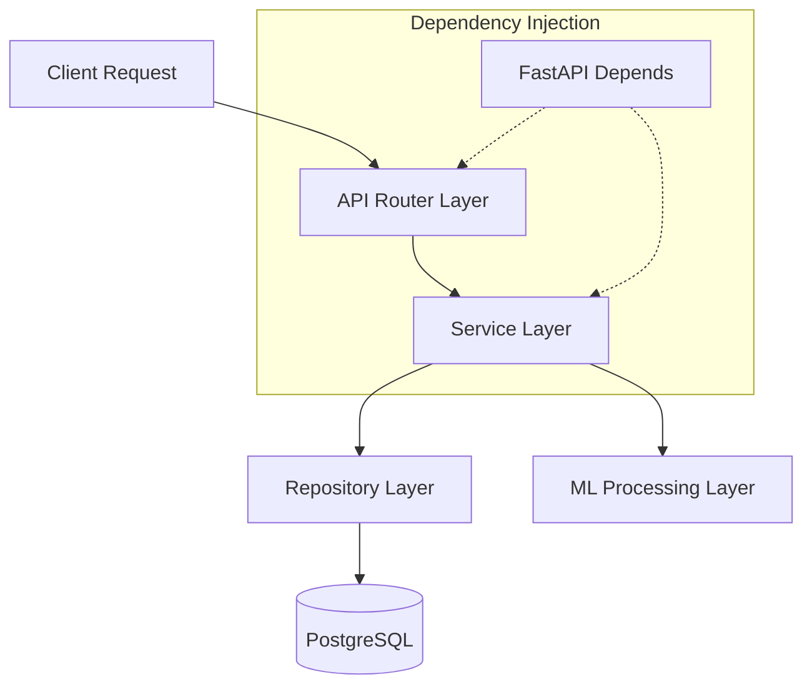

# BACKEND.md

## 1. FastAPI Architecture

MindGuard’s backend follows a strict **Layered (N-Tier) Architecture** within a micro-monolith structure. This ensures a clear separation of concerns, making the codebase highly testable, maintainable, and easily digestible for AI coding agents.

The core layers are:

1. **API Router (Controllers):** Handles HTTP requests, validates incoming payloads using Pydantic, and delegates logic to the Service Layer.
2. **Service Layer:** Contains core business logic, orchestrates ML tasks, and coordinates multiple repositories.
3. **Repository Layer:** Encapsulates all SQLAlchemy ORM operations. The rest of the application remains agnostic to the database implementation.
4. **Data Layer:** PostgreSQL database models.



---

## 2. Folder Structure

The `backend/` directory is structured to separate concerns and modularize domains.

```text
backend/
├── alembic/                # Database migrations (Alembic)
├── app/
│   ├── api/                # API Routers (endpoints separated by domain)
│   │   ├── v1/
│   │   │   ├── auth.py
│   │   │   ├── mood.py
│   │   │   └── ...
│   │   └── dependencies.py # Shared API dependencies (Auth, DB)
│   ├── core/               # Application-wide settings and configs
│   │   ├── config.py       # Pydantic BaseSettings
│   │   ├── exceptions.py   # Custom HTTP exceptions
│   │   ├── logger.py       # Logging configuration
│   │   └── security.py     # JWT & Password hashing logic
│   ├── db/                 # Database connection and base metadata
│   │   └── session.py
│   ├── ml/                 # Machine Learning integration
│   │   ├── models/         # Serialized models (.joblib, pt)
│   │   └── pipeline.py     # Inference wrappers
│   ├── models/             # SQLAlchemy ORM models
│   ├── repositories/       # Data Access Layer
│   ├── schemas/            # Pydantic models (Request/Response validation)
│   ├── services/           # Business logic
│   ├── tasks/              # Background tasks / Celery workers
│   └── main.py             # FastAPI application entry point
├── tests/                  # Pytest suite
├── pyproject.toml
└── requirements.txt

```

---

## 3. Repository Pattern

To abstract database transactions, the system enforces the Repository Pattern.

* **Rule:** API Routers and Services must **never** directly invoke `db.query()`.
* **Implementation:** Base generic repositories provide standard CRUD operations (`get`, `create`, `update`, `delete`). Domain-specific repositories inherit from the base and implement complex queries (e.g., `MoodRepository.get_history_by_student_id`).

---

## 4. Service Layer

The Service Layer acts as the orchestrator.

* **Rule:** All business rules (e.g., "If risk score is HIGH, generate an alert") live here.
* **Interactions:** Services are injected with required Repositories. For example, the `MoodService` handles the incoming mood entry, calls the `MLService` for inference, and uses the `AssessmentRepository` to persist the result.

---

## 5. Authentication & Authorization

* **Mechanism:** JWT (JSON Web Tokens) with a short-lived Access Token (e.g., 15 minutes) and a secure, HttpOnly Refresh Token (e.g., 7 days).
* **RBAC (Role-Based Access Control):** Implemented via dependency injection.
* **Flow:** The `get_current_user` dependency decrypts the JWT. Subsequent dependencies like `require_student_role` or `require_counselor_role` validate the `role` attribute before allowing endpoint execution.

---

## 6. Middleware

Global request processing is handled via FastAPI Middlewares:

1. **CORS Middleware:** Configured strictly to allow frontend domains.
2. **Request ID Middleware:** Generates a unique UUID for every incoming request and attaches it to logs for distributed tracing.
3. **Timing Middleware:** Measures and logs the execution time of endpoints to identify bottlenecks.
4. **Rate Limiting:** Protects `/auth` and `/mood` endpoints from abuse (e.g., limiting a user to 10 mood check-ins per minute).

---

## 7. Dependency Injection (DI)

FastAPI’s native `Depends()` system is the backbone of the architecture.

* **Database Sessions:** The `get_db` generator yields a SQLAlchemy session and closes it post-request.
* **Services & Repositories:** Instantiated dynamically per request via DI, ensuring isolated transactions.
* **Benefit:** Allows AI coding agents to easily mock dependencies during Pytest generation.

---

## 8. Configuration

Configuration is strictly managed via Pydantic `BaseSettings`.

* **Environment Variables:** Loaded automatically from a `.env` file or cloud secrets manager.
* **Validation:** Fails fast on startup if critical secrets (like `SECRET_KEY`, `POSTGRES_URI`, or ML Model paths) are missing.

---

## 9. Logging

* **Standard:** Structured JSON logging using a library like `structlog`.
* **Details:** Every log entry must include the `request_id`, `user_id` (if authenticated), and `timestamp`.
* **Privacy:** PII and sensitive health data must be masked or omitted from logs.

---

## 10. Exception Handling

Custom exception handlers are registered globally to standardize the API error schema.

* **Schema:** `{"error_code": string, "message": string, "details": dict}`.
* **Handlers:**
* `SQLAlchemyError` -> `500 INTERNAL SERVER ERROR` (hiding DB internals from clients).
* `PydanticValidationError` -> `422 UNPROCESSABLE ENTITY` (mapping exact field errors to `details`).
* Custom Domain Exceptions (e.g., `UserNotFoundException`) -> mapped to `404 NOT FOUND`.


---

## 11. ML Integration

Loading heavy ML models (Transformers, Scikit-learn) is computationally expensive and blocks the event loop.

* **Lifecycle:** Models are loaded into memory *once* during FastAPI's `lifespan` startup event to prevent disk I/O on every request.
* **Singleton Pattern:** The `MLService` utilizes singleton instances of the pre-loaded models.
* **Inference:** Heavy NLP inference operations must be offloaded to thread pools or background tasks to prevent blocking asynchronous API requests.

---

## 12. Background Tasks

To maintain high responsiveness (especially for the daily mood check-in), I/O bound or heavy ML operations are deferred.

* **Mechanism:** Use FastAPI’s native `BackgroundTasks` for lightweight defers (e.g., dispatching alert notifications).
* **Heavy Processing:** For extensive NLP processing on long journal entries, the architecture supports dropping the payload onto a queue (Redis/Celery) for decoupled processing, immediately returning a `202 Accepted` to the client.

---

## 13. Caching

* **Tool:** Redis.
* **Use Cases:**
* **Auth:** Blacklisting compromised JWTs.
* **Rate Limiting:** Tracking endpoint hits per user.
* **Data Caching:** Caching highly accessed, semi-static data like macro-level institutional reports (invalidated daily) or wellness activity recommendations.