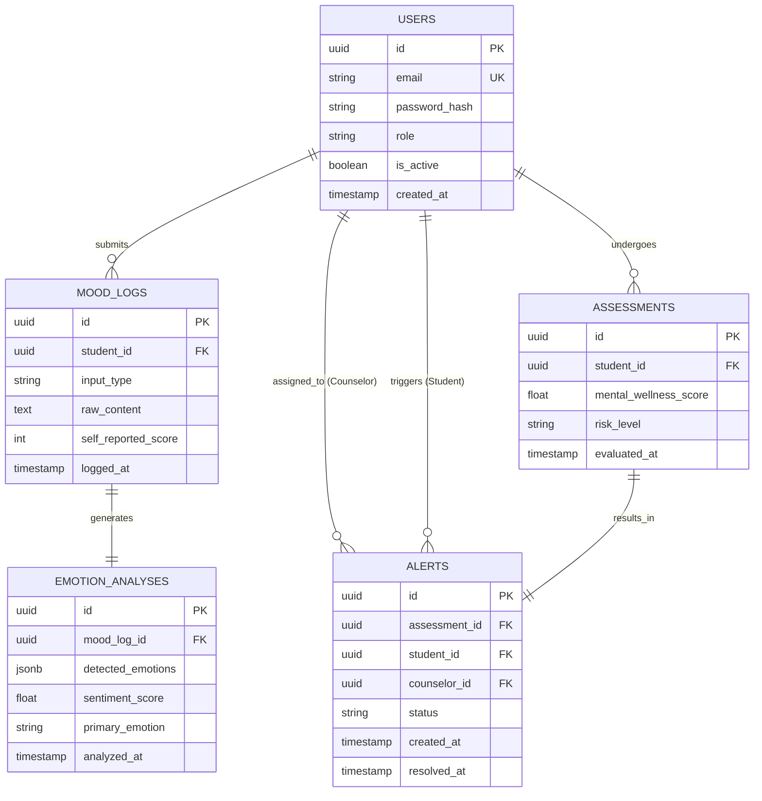

# DATABASE.md

## 1. Database Design Philosophy

MindGuard’s database is designed for PostgreSQL, optimizing for data privacy, relational integrity, and the flexibility required by machine learning pipelines.

* **Primary Keys:** UUID version 4 is used universally across all tables to prevent ID enumeration and enhance security.
* **Data Types:** Standard relational types are used for business logic, while `JSONB` is leveraged for storing dynamic, unstructured ML outputs (e.g., emotion probability matrices).
* **Immutability & Auditing:** Medical and psychological records require strict auditing. Hard deletions are restricted; instead, `is_active` flags or timestamp-based soft deletes are utilized. Row-level creation timestamps are mandatory.

---

## 2. Entity-Relationship (ER) Diagram

---

## 3. Table Definitions

### 3.1 USERS

Stores identity and role-based access control (RBAC) data for Students, Counselors, and Admins.

| Column Name | Data Type | Key | Constraints | Description |
| --- | --- | --- | --- | --- |
| `id` | UUID | PK | NOT NULL | Unique identifier (v4). |
| `email` | VARCHAR(255) | UK | NOT NULL, UNIQUE | User email address. |
| `password_hash` | VARCHAR(255) |  | NOT NULL | Bcrypt hashed password. |
| `role` | ENUM |  | NOT NULL | `'STUDENT'`, `'COUNSELOR'`, `'ADMIN'`. |
| `is_active` | BOOLEAN |  | DEFAULT TRUE | Soft delete toggle. |
| `created_at` | TIMESTAMP |  | DEFAULT NOW() | Account creation time. |

### 3.2 MOOD_LOGS

Captures the daily mental health inputs from students.

| Column Name | Data Type | Key | Constraints | Description |
| --- | --- | --- | --- | --- |
| `id` | UUID | PK | NOT NULL | Unique identifier. |
| `student_id` | UUID | FK | NOT NULL | References `USERS(id)`. |
| `input_type` | ENUM |  | NOT NULL | `'TEXT'`, `'VOICE'`, `'SURVEY'`. |
| `raw_content` | TEXT |  |  | The actual journal entry or transcript. |
| `self_reported_score` | INTEGER |  | CHECK (1-10) | Student's subjective score. |
| `logged_at` | TIMESTAMP |  | DEFAULT NOW() | Timestamp of submission. |

### 3.3 EMOTION_ANALYSES

Stores the output generated by the ML Processing Layer based on the mood log.

| Column Name | Data Type | Key | Constraints | Description |
| --- | --- | --- | --- | --- |
| `id` | UUID | PK | NOT NULL | Unique identifier. |
| `mood_log_id` | UUID | FK | NOT NULL, UNIQUE | References `MOOD_LOGS(id)`. |
| `detected_emotions` | JSONB |  | NOT NULL | Matrix of emotions (e.g., `{"joy": 0.1, "sadness": 0.8}`). |
| `sentiment_score` | FLOAT |  | CHECK (-1.0 to 1.0) | Aggregate NLP polarity. |
| `primary_emotion` | VARCHAR(50) |  | NOT NULL | Dominant extracted emotion. |
| `analyzed_at` | TIMESTAMP |  | DEFAULT NOW() | ML inference completion time. |

### 3.4 ASSESSMENTS

Stores the calculated mental wellness score and categorization based on the Emotion Analysis and historical data.

| Column Name | Data Type | Key | Constraints | Description |
| --- | --- | --- | --- | --- |
| `id` | UUID | PK | NOT NULL | Unique identifier. |
| `student_id` | UUID | FK | NOT NULL | References `USERS(id)`. |
| `mental_wellness_score` | FLOAT |  | CHECK (0.0 to 100.0) | System calculated well-being metric. |
| `risk_level` | ENUM |  | NOT NULL | `'LOW'`, `'MEDIUM'`, `'HIGH'`. |
| `evaluated_at` | TIMESTAMP |  | DEFAULT NOW() | Timestamp of evaluation. |

### 3.5 ALERTS

Facilitates the Early Warning System, tracking high-risk assessments routed to counselors.

| Column Name | Data Type | Key | Constraints | Description |
| --- | --- | --- | --- | --- |
| `id` | UUID | PK | NOT NULL | Unique identifier. |
| `assessment_id` | UUID | FK | NOT NULL, UNIQUE | References `ASSESSMENTS(id)`. |
| `student_id` | UUID | FK | NOT NULL | References `USERS(id)`. |
| `counselor_id` | UUID | FK | NULLABLE | References `USERS(id)` (Counselor). NULL if unassigned. |
| `status` | ENUM |  | NOT NULL | `'PENDING'`, `'REVIEWED'`, `'RESOLVED'`. |
| `created_at` | TIMESTAMP |  | DEFAULT NOW() | Time the alert was generated. |
| `resolved_at` | TIMESTAMP |  | NULLABLE | Time the counselor closed the alert. |

---

## 4. Relationships and Cascading Rules

To maintain clinical data integrity, hard deletes are strictly controlled.

* **`USERS` -> `MOOD_LOGS`, `ASSESSMENTS`, `ALERTS`:** `ON DELETE RESTRICT`. A user with active medical history cannot be deleted from the database; their `is_active` flag must be set to `FALSE` instead to preserve historical analytics.
* **`MOOD_LOGS` -> `EMOTION_ANALYSES`:** `ON DELETE CASCADE`. If a mood log is legally required to be expunged, its associated ML analysis is safely destroyed with it.
* **`ASSESSMENTS` -> `ALERTS`:** `ON DELETE CASCADE`. An alert cannot exist without its triggering assessment.

---

## 5. Indexing Strategy

Optimizing for dashboard read-heavy operations and rapid background queries.

* **B-Tree Indexes:**
* `idx_mood_logs_student_date` on `MOOD_LOGS(student_id, logged_at DESC)`: Speeds up querying historical data for the Student Dashboard.
* `idx_alerts_status_counselor` on `ALERTS(status, counselor_id)`: Optimizes the queue fetching for the Counselor Dashboard (e.g., finding all `PENDING` alerts).
* `idx_assessments_student_risk` on `ASSESSMENTS(student_id, risk_level)`: Accelerates institutional aggregation and student history lookups.

* **GIN (Generalized Inverted Index):**
* `idx_emotions_jsonb` on `EMOTION_ANALYSES USING GIN (detected_emotions)`: Enables efficient querying inside the JSONB payload (e.g., finding all logs where `"anxiety" > 0.8` for macro-analytics).

---

## 6. Migration Strategy

Database schema evolution is managed via **Alembic** (integrated with SQLAlchemy).

1. **Version Control:** All schema changes must be represented as Python migration scripts in the `/backend/alembic/versions` directory.
2. **Up/Down Methodology:** Every migration script must include a rigorous `upgrade()` and `downgrade()` function to allow rollbacks without data corruption.
3. **CI/CD Validation:** GitHub Actions will spin up an ephemeral PostgreSQL container, run `alembic upgrade head`, and execute API tests against the migrated schema before allowing a merge to `main`.
4. **Zero-Downtime:** Migrations must be designed not to lock tables for extended periods (using `CONCURRENTLY` for index creation where applicable).

---

## 7. Sample Records

**USERS Table**

| id | email | role | is_active | created_at |
| --- | --- | --- | --- | --- |
| `u-1111` | `sam@student.edu` | `STUDENT` | TRUE | `2026-06-25T08:00:00Z` |
| `u-2222` | `clara@clinic.edu` | `COUNSELOR` | TRUE | `2026-01-10T09:30:00Z` |

**MOOD_LOGS Table**

| id | student_id | input_type | raw_content | self_reported_score | logged_at |
| --- | --- | --- | --- | --- | --- |
| `m-101` | `u-1111` | `TEXT` | "I feel overwhelmed by my midterms." | 3 | `2026-06-26T14:20:00Z` |

**EMOTION_ANALYSES Table**

| id | mood_log_id | detected_emotions | sentiment_score | primary_emotion |
| --- | --- | --- | --- | --- |
| `e-202` | `m-101` | `{"anxiety": 0.85, "sadness": 0.60, "joy": 0.05}` | -0.75 | `anxiety` |

**ASSESSMENTS Table**

| id | student_id | mental_wellness_score | risk_level | evaluated_at |
| --- | --- | --- | --- | --- |
| `a-303` | `u-1111` | 32.5 | `HIGH` | `2026-06-26T14:21:05Z` |

**ALERTS Table**

| id | assessment_id | student_id | counselor_id | status | created_at |
| --- | --- | --- | --- | --- | --- |
| `al-404` | `a-303` | `u-1111` | `NULL` | `PENDING` | `2026-06-26T14:21:06Z` |