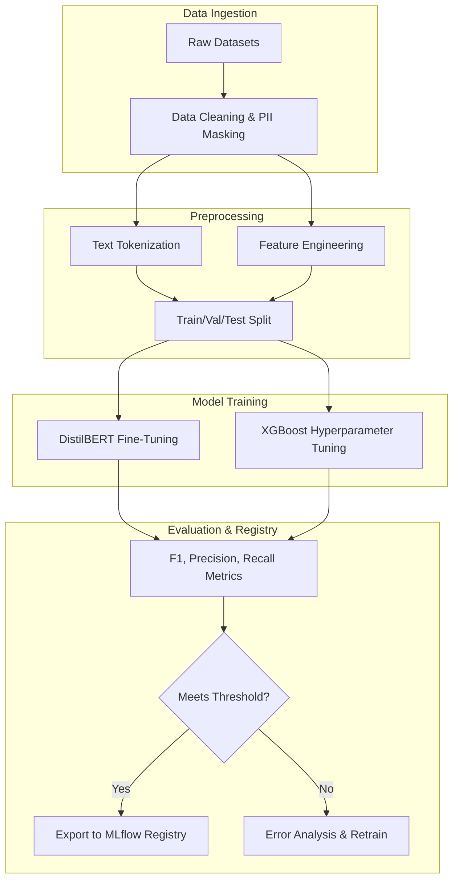
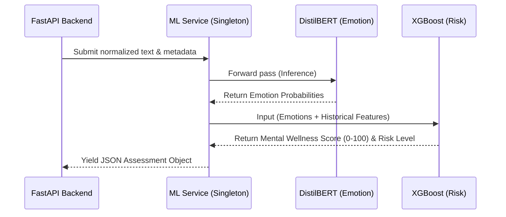

# ML.md

## 1. Overview

The Machine Learning (ML) architecture of MindGuard is responsible for translating raw qualitative inputs (journal entries, voice transcripts) and quantitative data (survey responses) into actionable mental wellness insights. The system prioritizes low-latency inference for the real-time application and high recall to ensure no at-risk student is overlooked.

---

## 2. Datasets

The training and validation phases utilize a combination of open-source NLP datasets and clinical baselines to ensure robust emotion detection and risk stratification.

| Dataset | Purpose in MindGuard | Justification |
| --- | --- | --- |
| **GoEmotions Dataset** | Training the Emotion Detection Engine. | Contains 58k Reddit comments labeled with 27 emotion categories. Ideal for capturing nuanced, conversational text typical of student journaling. |
| **Emotion Dataset (Kaggle)** | Baseline sentiment and basic emotion classification. | Provides a clean, well-structured corpus mapping text directly to core emotions (sadness, joy, fear, anger, love, surprise). |
| **Student Depression Dataset** | Training the Risk Assessment Engine. | Features specific to the academic demographic (e.g., study hours, financial stress, sleep patterns) to correlate behavioral markers with depression risk. |
| **PHQ-9 Data** | Clinical threshold mapping for depressive symptoms. | Gold standard Patient Health Questionnaire data used to label the output tiers (Low/Medium/High Risk) based on severity indices. |
| **GAD-7 Data** | Clinical threshold mapping for anxiety symptoms. | Gold standard Generalized Anxiety Disorder data used to calibrate the early warning system for anxiety-specific interventions. |

---

## 3. Data Preprocessing & Feature Engineering

### Data Preprocessing

* **Text Normalization:** Lowercasing, removal of special characters, and expansion of contractions.
* **Tokenization & Masking:** Utilizing HuggingFace tokenizers. Personally Identifiable Information (PII) such as names or student IDs are masked using Named Entity Recognition (NER) before entering the ML pipeline to preserve privacy.
* **Handling Imbalanced Data:** Employing Synthetic Minority Over-sampling Technique (SMOTE) for tabular clinical data and focal loss functions for NLP to ensure high-risk (minority class) profiles are accurately detected.

### Feature Engineering

* **Temporal Features:** Extracting contextual features such as `time_of_day`, `day_of_week`, and `proximity_to_exams` (derived from the institutional calendar) to weight academic stress.
* **Historical Aggregates:** Calculating rolling averages of the student's `self_reported_score` and `sentiment_score` over 7-day and 30-day windows.
* **Volatility Index:** Measuring the standard deviation of a student's mood over time to detect rapid emotional cycling, a strong indicator of mental distress.

---

## 4. Model Selection

### Emotion Detection Engine

* **Algorithm:** DistilBERT (fine-tuned).
* **Justification:** Transformer architectures capture the semantic context of text far better than traditional Bag-of-Words models. DistilBERT retains 97% of BERT's language understanding but is 60% faster and 40% smaller, making it ideal for synchronous FastAPI inference without requiring heavy GPU infrastructure in production.

### Risk Assessment Engine

* **Algorithm:** Random Forest Classifier / XGBoost.
* **Justification:** In healthcare applications, explainability is paramount. Tree-based models allow counselors to see *why* a student was flagged (feature importance). Furthermore, they handle tabular data (survey scores, temporal features, historical aggregates) exceptionally well.

---

## 5. Training Pipeline

The training pipeline is designed to be fully reproducible and modular.



---

## 6. Evaluation Metrics

Models are evaluated with a strict bias toward minimizing False Negatives (missing a high-risk student).

* **Risk Assessment (High-Risk Classification):**
* **Recall (Sensitivity):** Primary metric. Must exceed 95% to ensure safety.
* **ROC-AUC:** Used to measure overall class separation capability.


* **Emotion Detection (Multi-label Classification):**
* **Macro F1-Score:** Ensures the model performs equally well across all 27 GoEmotions categories, not just the heavily represented ones.


---

## 7. Model Versioning (MLOps)

* **Tracking:** **MLflow** is utilized to track all experiments, logging parameters (learning rate, tree depth), metrics (Recall, F1), and artifacts.
* **Artifact Storage:** Serialized models (PyTorch `.pt` files for DistilBERT, `.joblib` for Scikit-learn/XGBoost) are stored in AWS S3, linked to the MLflow registry.
* **Promotion:** Models progress through `Staging` -> `Production` tags. The CI/CD pipeline fetches the model tagged as `Production` during the Docker build phase.

---

## 8. Inference Pipeline

The inference pipeline runs synchronously for standard check-ins and asynchronously for large batch analyses.



* **Singleton Pattern:** Models are loaded into memory exactly once during the FastAPI `@app.lifespan` startup event to completely eliminate disk I/O bottlenecks during individual API requests.

---

## 9. Recommendation Engine

The Recommendation Engine utilizes a **Contextual Content-Based Filtering** approach rather than Collaborative Filtering, ensuring high privacy (student recommendations are not based on other students' data) and avoiding cold-start problems.

* **Inputs:** Current `primary_emotion` (e.g., anxiety, burnout), `risk_level`, and `time_of_day`.
* **Mapping Matrix:** * If `risk_level == MEDIUM` AND `primary_emotion == 'anxiety'`, the system retrieves short, actionable mindfulness or breathing exercise vectors.
* If `primary_emotion == 'burnout'`, it suggests scheduling management articles.


* **Feedback Loop:** Future iterations will adjust recommendation weights based on user engagement (e.g., completion rate of recommended videos).

---

## 10. Folder Structure

The ML layer is cleanly decoupled within the backend repository.

```text
backend/app/ml/
├── data/                  # Data loaders and validation schemas
├── features/              # Feature engineering logic (historical aggregates)
├── models/                # Downloaded artifacts (ignored in git via .gitignore)
│   ├── distilbert_v1.pt
│   └── risk_rf_v2.joblib
├── pipelines/             # Training scripts and evaluation logic
│   ├── train_emotion.py
│   └── train_risk.py
├── recommend/             # Recommendation engine rule matrix
├── evaluate.py            # Script for generating validation reports
└── inference.py           # Singleton classes for loading models and exposing predict()

```