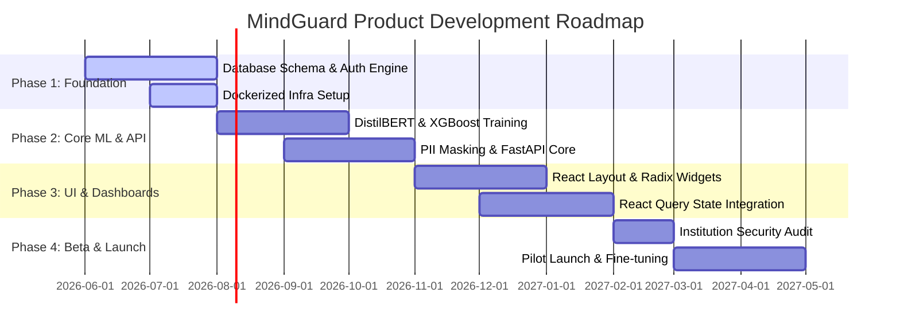

# ROADMAP.md

## 1. Product & Engineering Roadmap Overview

The development and deployment of MindGuard are divided into four structured, sequential phases. This ensures core data security and ML capabilities are validated before public beta enrollment.

---

## 2. Core Development Phases

### 2.1 Phase 1: Foundation
* **Goal:** Establish a secure, repeatable workspace baseline.
* **Backend:** Implement core PostgreSQL database schemas utilizing UUIDv4 fields. Setup Alembic database migrations.
* **Authentication:** Build the JWT-based security flow, incorporating HttpOnly cookies for refresh token security.
* **DevOps:** Orchestrate local development environments using multi-container Docker Compose configurations (`frontend`, `api`, `db`, and `ml-worker` on private isolated networks).

### 2.2 Phase 2: Core ML & API
* **Goal:** Develop validation pipelines and backend REST endpoints.
* **ML Pipelines:** Fine-tune DistilBERT utilizing the GoEmotions corpus and train XGBoost models on student clinical risk features. Ensure Named Entity Recognition (NER) anonymization filters are in place.
* **API Endpoints:** Deliver FastAPI routes for student check-ins and counselor workspace metrics.
* **Testing:** Configure Pytest overrides, mocking databases and external notifications to run on GitHub Actions.

### 2.3 Phase 3: Frontend & Dashboards
* **Goal:** Provide responsive interfaces for students, counselors, and administrators.
* **Student View:** Build the mood check-in wizard and radial score visualizers.
* **Staff Views:** Deploy the active counselor alerts table utilizing `shadcn/ui` data table components. Deploy institutional risk-distribution charts utilizing Recharts.
* **State Management:** Complete React Query integration, implementing optimistic updates and cache invalidation policies.

### 2.4 Phase 4: Beta & Launch
* **Goal:** Audit and deploy the platform within a partner university.
* **Audits:** Complete compliance reviews assessing PII data scrubbing and database access permissions.
* **Pilot:** Deploy to staging on AWS, utilizing a load balancer and secure RDS PostgreSQL databases.
* **Rollout:** Initiate a 500-student pilot scheme to evaluate prediction accuracy and feedback mechanisms.

---

## 3. Future Scope

Following Phase 4, the platform will expand to include the following advanced features:

### 3.1 Multilingual NLP Support
* Fine-tune multilingual transformer models (e.g., XLM-RoBERTa) to detect mental health indicators and emotions in diverse student cohorts speaking Spanish, Mandarin, Hindi, and other languages.

### 3.2 Voice-Based Emotion Tracking
* Integrate audio sentiment parsing models (e.g., Wav2Vec2) to process student voice journals. The system will detect emotional distress directly from pitch, tone, and pacing anomalies, supplementing text-based analysis.

### 3.3 Smart Wearable Integrations
* Support voluntary connections to wearable APIs (e.g., Apple HealthKit, Fitbit, Garmin). The platform will ingest physiological metrics like sleep duration, heart-rate variability (HRV), and daily step counts to provide context for risk models.

### 3.4 Advanced Predictive Analytics
* Implement temporal sequence models (e.g., LSTMs or GRUs) to detect long-term behavioral changes. By identifying steady, downward trends in mood variance, counselors can intervene before an acute crisis occurs.

---

## 4. Business Model & Scale

MindGuard is structured as an **Institutional Software-as-a-Service (SaaS)** solution, targeting universities, colleges, and large-scale educational systems.

### 4.1 Subscription Tiers
* **Standard Tier:** Covers student check-ins, automated self-help resources, and local counselor queues.
* **Premium Tier:** Adds aggregate institutional analytics, wearable integrations, and advanced predictive analytics dashboards.

### 4.2 Deployment Scale
* **Infrastructure Design:** Built on AWS ECS / EKS with auto-scaling groups, allowing the API and ML inference layers to scale dynamically to handle high-traffic check-in periods (e.g., mid-terms and finals weeks).
* **Data Isolation:** Each institution is provisioned with a dedicated logical PostgreSQL database database instance to ensure compliance with education and medical records privacy regulations.
