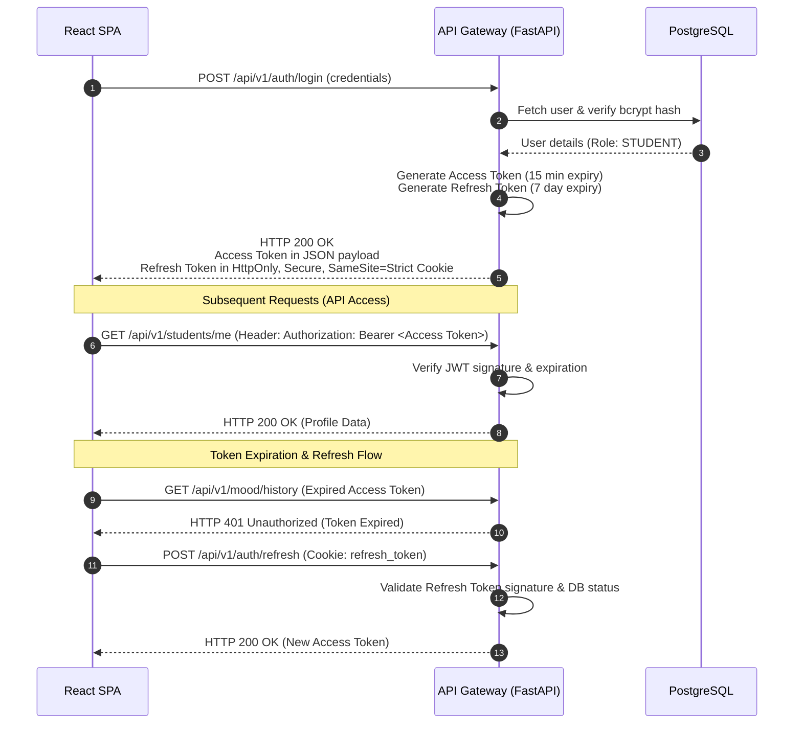

# SECURITY.md

## 1. Security Architecture & Threat Model

MindGuard is designed with a defense-in-depth architecture to secure sensitive student mental health data. As a system handling clinical indicators and personal narratives, our security posture aligns with healthcare standards (e.g., HIPAA principles) while providing a low-latency user experience.

### 1.1 Threat Model (STRIDE)

We evaluate the system architecture against the STRIDE threat model:

| Threat Category | Potential Risk in MindGuard | Mitigation Strategy |
| --- | --- | --- |
| **Spoofing Identity** | Adversary accesses a student or counselor account to view private logs. | Multi-factor authentication ready; cryptographically signed JWTs; bcrypt password hashing. |
| **Tampering with Data** | Malicious alteration of clinical risk scores or database journals. | SQLAlchemy parameterized queries; strict database constraints; read-only database views where applicable. |
| **Repudiation** | A user denies sending an alert or modifying a student record. | Structured application logs with transaction tracking IDs; database row-level audit fields (`created_at`, updated by). |
| **Information Disclosure** | Unencrypted student journals or clinical risk metrics leaked online. | TLS 1.3 in transit; AES-256 database encryption at rest; NER-based PII scrubbing before ML inference. |
| **Denial of Service** | Flooding the API Gateway to prevent at-risk students from seeking help. | FastAPI rate-limiting middleware; AWS Application Load Balancer (ALB) auto-scaling; decoupled async ML workers. |
| **Elevation of Privilege** | Student account accessing counselor dashboards or administrative analytics. | Role-Based Access Control (RBAC) enforced cryptographically via JWT claims and FastAPI dependencies. |

---

## 2. JWT Authentication Lifecycle

MindGuard employs token-based authentication using JSON Web Tokens (JWT). The lifecycle is divided into short-lived **Access Tokens** and long-lived **Refresh Tokens**.



### 2.1 Token Storage & Configuration
* **Access Token:**
  * **Lifetime:** 15 minutes.
  * **Storage:** In-memory (React State). Never stored in LocalStorage or SessionStorage to prevent Cross-Site Scripting (XSS) extraction.
  * **Transmission:** Attached as a Bearer token in the HTTP `Authorization` header.
* **Refresh Token:**
  * **Lifetime:** 7 days.
  * **Storage:** Stored in a browser cookie with the following security attributes:
    * `HttpOnly`: Prevents client-side Javascript from reading the cookie, mitigating XSS.
    * `Secure`: Forces transmission only over encrypted HTTPS connections.
    * `SameSite=Strict`: Restricts cookie transmission on cross-site requests, mitigating Cross-Site Request Forgery (CSRF).
  * **Transmission:** Sent automatically by the browser to `/api/v1/auth/refresh`.

---

## 3. Role-Based Access Control (RBAC)

The platform enforces three distinct user roles: `STUDENT`, `COUNSELOR`, and `ADMIN`. Authorization checks are applied globally at the API Gateway layer using FastAPI dependencies.

### 3.1 Role Hierarchy & Permissions

| Endpoint Path | Allowed Roles | Description |
| --- | --- | --- |
| `/api/v1/students/me` | `STUDENT` | Access own profile and registration parameters. |
| `/api/v1/mood/check-in` | `STUDENT` | Submit daily journal texts or survey responses. |
| `/api/v1/mood/history` | `STUDENT` | View personal historical mood trajectories. |
| `/api/v1/counselor/alerts` | `COUNSELOR` | View active high-risk student warnings. |
| `/api/v1/counselor/students/{id}` | `COUNSELOR` | View specific student details assigned to them. |
| `/api/v1/admin/analytics` | `ADMIN` | Access anonymized institutional stress metrics. |

### 3.2 Backend Code Implementation Example
FastAPI route protection is implemented via reusable dependencies:

```python
from fastapi import Depends, HTTPException, status
from app.core.security import get_current_user
from app.schemas.users import User

def require_role(allowed_roles: list[str]):
    def dependency(current_user: User = Depends(get_current_user)):
        if current_user.role not in allowed_roles:
            raise HTTPException(
                status_code=status.HTTP_403_FORBIDDEN,
                detail="Operation not permitted for this role"
            )
        return current_user
    return dependency

# Route definition example
@router.get("/counselor/alerts")
def get_alerts(current_user: User = Depends(require_role(["COUNSELOR"]))):
    return alert_service.get_active_alerts(counselor_id=current_user.id)
```

---

## 4. Healthcare Compliance & Data Privacy

To ensure compliance with general healthcare standards (e.g., HIPAA-like security guidelines) and safeguard mental health data, MindGuard applies three critical layers of data protection.

### 4.1 Named Entity Recognition (NER) for PII Masking
Before a student's raw text entry is transmitted to the NLP models (DistilBERT) for emotion detection, it passes through a Named Entity Recognition (NER) preprocessor. 

* **Mechanism:** Spacy or HuggingFace NER models detect entities such as `PERSON` (names), `ORG` (institutions), `GPE` (locations), `DATE`, and numeric patterns (student IDs, phone numbers).
* **Action:** Detected entities are masked with placeholder tokens (e.g., `[REDACTED_NAME]`, `[REDACTED_LOCATION]`).
* **Benefit:** Ensures that external or local ML model instances never process raw, identifying metadata.

### 4.2 Database Anonymization & Encryption
* **Data at Rest:** All Postgres data tables are hosted on encrypted filesystems using AES-256 standards.
* **Separation of Concerns:** Relational records containing PII (e.g., name, email in `USERS`) are logically separated from psychiatric observations (`MOOD_LOGS` and `EMOTION_ANALYSES`). Relational integrity is maintained solely via randomized UUID v4 identifiers, preventing direct data mapping during audits.
* **Soft Deletions:** When a user requests account deletion, a scrubbing script executes to completely wipe email records and raw text journals from the database, leaving only anonymized, aggregated demographic inputs for institutional analytics.

---

## 5. OWASP Top 10 Mitigations

MindGuard actively mitigates common web application security risks defined in the OWASP Top 10 framework:

### 5.1 Injection (A03:2021)
* **SQL Injection:** We use **SQLAlchemy ORM** for all database operations. SQLAlchemy uses parameterized query compilation by default, which ensures user-supplied input (like journals or query strings) cannot alter the structure of SQL statements. Direct SQL executions are strictly prohibited.
* **Command Injection:** The system does not utilize OS-level command invocations (`subprocess`, `os.system`) to handle application logic.

### 5.2 Broken Access Control (A01:2021)
* Every endpoint validating a resource (e.g., retrieving a mood log by ID) implements owner validation checks to ensure `current_user.id == target_log.student_id`, preventing Insecure Direct Object Reference (IDOR) vulnerabilities.

### 5.3 Cryptographic Failures (A02:2021)
* Passwords are never stored in plaintext. They are hashed using **Bcrypt** (work factor 12) before persistence.
* All external data exchanges require TLS 1.3.

### 5.4 Cross-Site Scripting (XSS) Mitigation
* React automatically escapes variables rendered in the JSX DOM tree, preventing typical HTML injection payloads.
* For the markdown parser used in rendering counselor notes, we apply DOMPurify to scrub user-generated input of malicious `<script>` tags and `onload` actions.

### 5.5 Cross-Origin Resource Sharing (CORS) Policy
* CORS is configured using FastAPI's standard middleware, specifying explicit origin domain white-lists (e.g., `https://mindguard.university.edu`). Wildcards (`*`) are disallowed on all authenticated endpoints.
